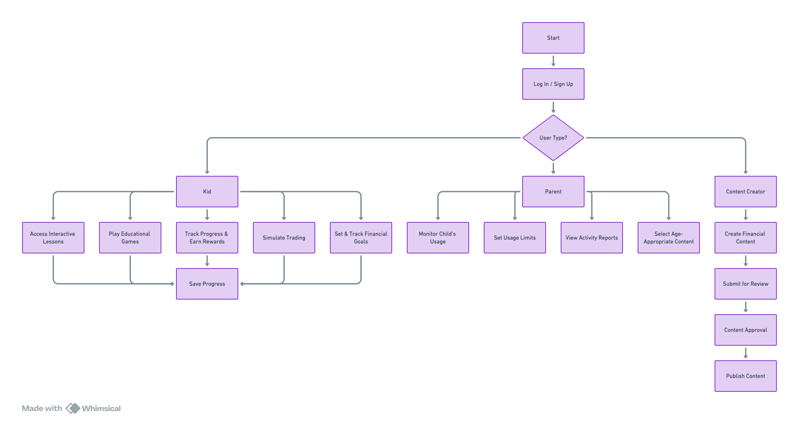
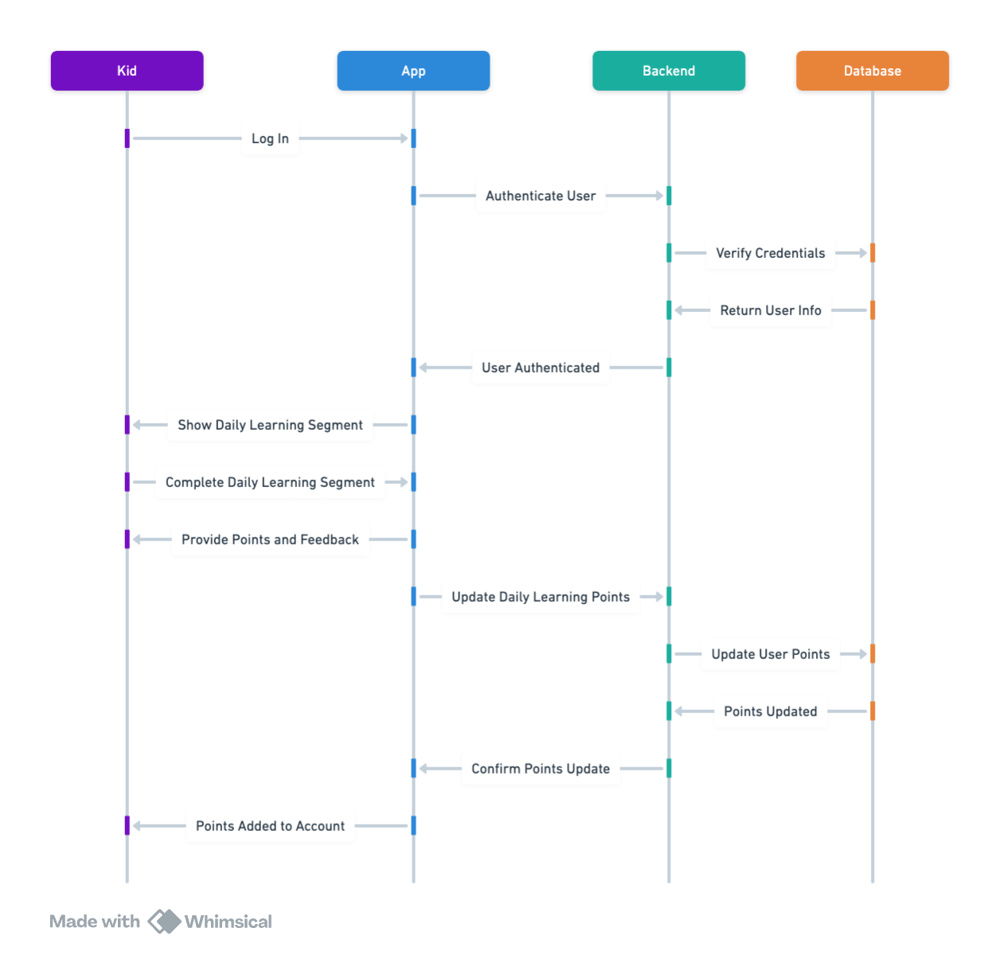
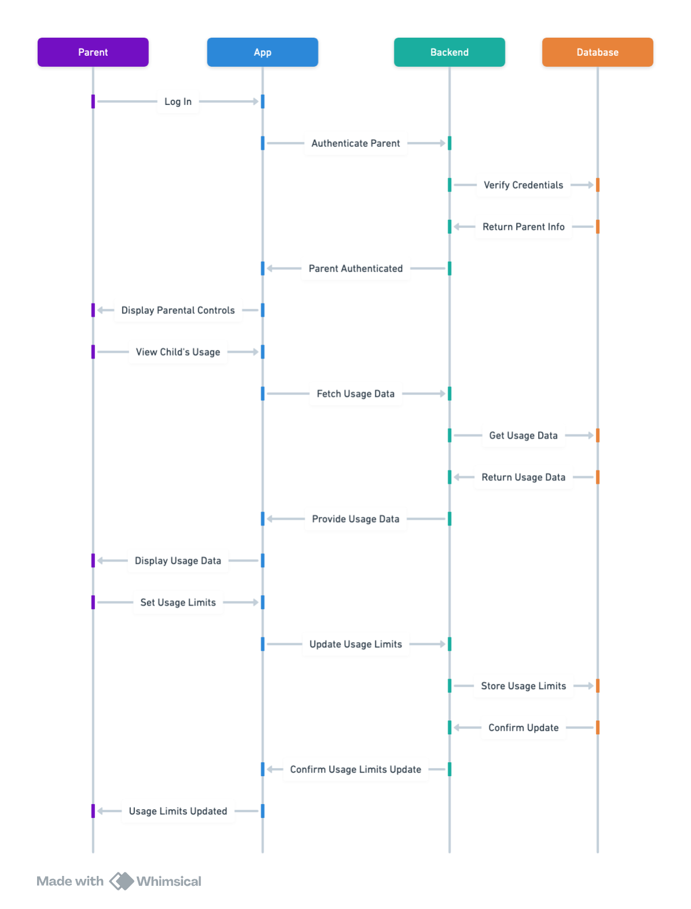
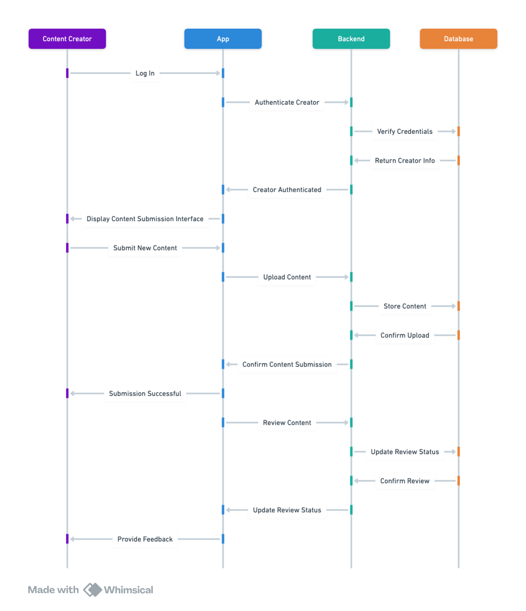

## Kids Financial Learning App 
#### Overview
A mobile app designed to teach kids about investing and financial management through interactive lessons, games, and activities.
#### Features
- Interactive lessons on investing and financial management
- Educational games and quizzes
- Progress tracking and rewards system
- Parental controls and monitoring
- Age-appropriate content
- Virtual currency and simulated trading
- Financial goal setting and tracking
- Tips and advice from financial experts
- User-friendly interface for kids
- Regular updates with new content
- Weekly education sessions requirement for trading
- Daily learning segments with a points system similar to Snapchat
- Ability for financial content creators to publish financial content for kids
#### Functionalities
- Provide interactive lessons on various financial topics
- Include educational games and quizzes to reinforce learning
- Track user progress and offer rewards for achievements
- Allow parents to monitor and control app usage
- Ensure content is suitable for different age groups
- Simulate trading with virtual currency
- Enable users to set and track financial goals
- Offer tips and advice from financial experts
- Design a user-friendly interface tailored for kids
- Regularly update the app with new educational content
- Require completion of weekly education sessions to unlock trading features
- Implement a daily learning segment completion requirement with a points system
- Allow financial content creators to publish kid-friendly financial content
#### Goals
- Educate kids on the basics of investing and financial management
- Make learning about finance fun and engaging
- Encourage responsible financial habits from a young age
- Provide a safe and controlled environment for financial education
- Continuously improve the app with new content and features
- Ensure kids complete educational sessions regularly to reinforce learning
- Motivate kids to engage with the app daily through a points system
- Expand the app's educational content by enabling financial content creators to contribute

## User Persona & User Stories
### Overview
Educate kids on investing and financial management through interactive and engaging content.
### User Persona 1 : Kid - A user who is learning about finance through the app.
- **As a kid,** I want to access interactive lessons on investing and financial management so that I can learn about finance in a fun way.

	- **Acceptance Criteria:**
		- The app provides age-appropriate interactive lessons.
		- Lessons include animations, videos, and quizzes.
		- Progress is saved automatically.
	
- **As a kid,** I want to play educational games and quizzes so that I can reinforce my learning.

	- **Acceptance Criteria:**
		- The app includes various educational games and quizzes.
		- Games and quizzes are related to financial topics.
		- Points and rewards are given for completing games and quizzes.

- **As a kid,** I want to track my progress and earn rewards so that I stay motivated.

	- **Acceptance Criteria:**
		- The app tracks progress and displays it on a dashboard.
		- Rewards are given for completing lessons and activities.
		- A points system is implemented for daily learning segments.

- **As a kid,** I want to simulate trading with virtual currency so that I can practice trading without real money.

	-	**Acceptance Criteria:**
		-	The app provides a virtual currency for trading.
		-	Trading features are unlocked after completing weekly education sessions.
		-	A simulated trading environment is provided.

- **As a kid,** I want to set and track financial goals so that I can learn to manage my finances.

	- **Acceptance Criteria:**
		- The app allows setting financial goals.
		- Progress towards goals is tracked and displayed.
		- Tips and advice are provided to achieve goals.

### User Persona 2 : Parent - A user who monitors and controls their child's app usage.
- **As a parent,** I want to monitor and control my child's app usage so that I can ensure a safe learning environment.
	- **Acceptance Criteria:**
		- The app provides parental controls and monitoring features.
		- Parents can set usage limits and view activity reports.
		- Notifications are sent for important activities.

- **As a parent,** I want to ensure the content is age-appropriate so that my child receives suitable learning material.
	- **Acceptance Criteria:**
		- The app categorizes content by age group.
		- Parents can select the appropriate age group for their child.
		- Content is reviewed and updated regularly.

### User Persona 3 : Financial Content Creator - A user who publishes financial content for kids.
- **As a financial content creator,** I want to publish kid-friendly financial content so that I can contribute to the app's educational material.

    - **Acceptance Criteria:**
		- The app allows publishing of financial content.
		- Content is reviewed and approved before being published.
		- Creators receive feedback and analytics on their content.

		
## App Flowchart

## App Interaction Diagram
- ### Kid

- ### Parent

- ### Financial Content Creator
